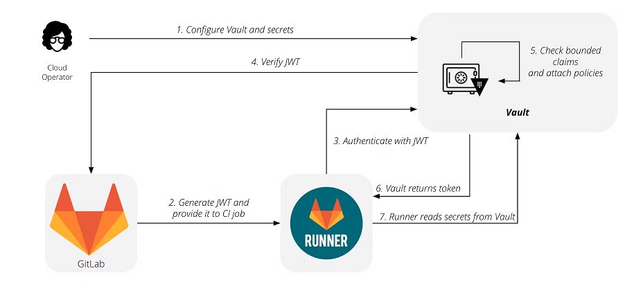
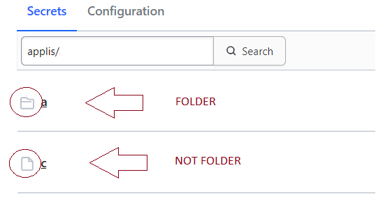

# Hashicorp Vault / Gitlab

Linking Vault & Gitlab in Communition Edition brings some constraints.

## Concepts

For each job, Gitlab provides a JWT token.  
The runner returns this JWT and a "role name" when he will authenticate to Vault.  
Vault receives this token which contains some claims and compare them with theirs described in his role.  
The Vault role has policies linked. Only secrets from these policies will be allowed.  
If passed, Vault returns a token to runner.  
The runner reads secrets from Vault with this token.



Example of token provided by Gitlab

```json
{
  "kid": "3c-J-jPF6dm453ZAxudq8lBdjDXL_zPkEujYdAWAz0",
  "typ": "JWT",
  "alg": "RS256"
}
{
  "namespace_id": "52",
  "namespace_path": "ns",
  "project_id": "22",
  "project_path": "ns/poc-vault",
  "user_id": "26",
  "user_login": "monlogin",
  "user_email": "prenom.nom@mail.com",
  "user_access_level": "owner",
  "pipeline_id": "318",
  "pipeline_source": "push",
  "job_id": "972",
  "ref": "main",
  "ref_type": "branch",
  "ref_path": "refs/heads/main",
  "ref_protected": "true",
  "runner_id": 39,
  "runner_environment": "self-hosted",
  "sha": "edac6ds25bd7c523347f18b48db5f41115a40c4d",
  "project_visibility": "internal",
  "ci_config_ref_uri": "gitlab.com/ns/poc-vault/.gitlab-ci.yml@refs/heads/main",
  "ci_config_sha": "edac6f825bd7a523357a18b48dbef48325940c4d",
  "jti": "06636c24-a820-4509-a18c-9796da061f94",
  "iss": "https://gitlab.com",
  "iat": 1711534889,
  "nbf": 1711534884,
  "exp": 1711538489,
  "sub": "project_path:ns/poc-vault:ref_type:branch:ref:main",
  "aud": "https://gitlab.com/"
}
```

## Vault

GitLab Community Edition users can pull secrets from Vault.  
You must manually set the authentication environment variables to do so.

🔗 https://developer.hashicorp.com/well-architected-framework/security/security-cicd-vault#gitlab

Here we go !

### Setup Vault

Enable JWT authentication
```bash
$ vault auth enable jwt
Success! Enabled jwt auth method at: jwt/
$ vault write auth/jwt/config \
  oidc_discovery_url="https://gitlab.com" \
  bound_issuer="https://gitlab.com"
Success! Data written to: auth/jwt/config
```

Create a policy

> :warning: The policies applies only on Vault folders



```bash
$ vault policy write poc-vault - <<EOF
# Read-only permission on 'kv/applis/myapp/*' path
path "kv/data/applis/myapp/*" {
  capabilities = [ "read" ]
}
EOF
Success! Uploaded policy: poc-vault
```

Create a role linked to JWT auth and the policy we have created above
```bash
$ vault write auth/jwt/role/poc-vault - <<EOF
{
  "role_type": "jwt",
  "policies": ["poc-vault"],
  "token_explicit_max_ttl": 60,
  "user_claim": "user_login",
  "bound_claims_type": "glob",
  "bound_claims": {
    "project_id": "22",
    "ref_type": "branch",
    "ref": "main"
  }
}
EOF
Success! Data written to: auth/jwt/role/poc-vault
```

### Create .gitlab-ci.yml file

```yaml
# .gitlab-ci.yml
read_secrets:
  image: hashicorp/vault:latest
  id_tokens:
    VAULT_ID_TOKEN:
      aud: https://gitlab.com/
  script:
    - export VAULT_ADDR=https://vault.local/
    # authenticate and get token. Token expiry time and other properties can be configured
    # when configuring JWT Auth - https://developer.hashicorp.com/vault/api-docs/auth/jwt#parameters-1
    - export VAULT_TOKEN="$(vault write -field=token auth/jwt/login role=poc-vault jwt=$VAULT_ID_TOKEN)"
    # use the VAULT_TOKEN to read the secret and store it in an environment variable
    - export PASSWORD="$(vault kv get -field=dbpass kv/applis/myapp/front)"
    - echo $PASSWORD
```

### Industrialization

> 💡 Treats policies and configuration elements as IAC

- Rootless process
- Full TLS
- Admin policy
- Admin user
- Revocation root token
- IAC -> https://developer.hashicorp.com/vault/tutorials/operations/codify-mgmt-vault-terraform