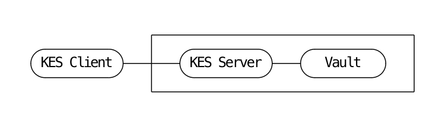
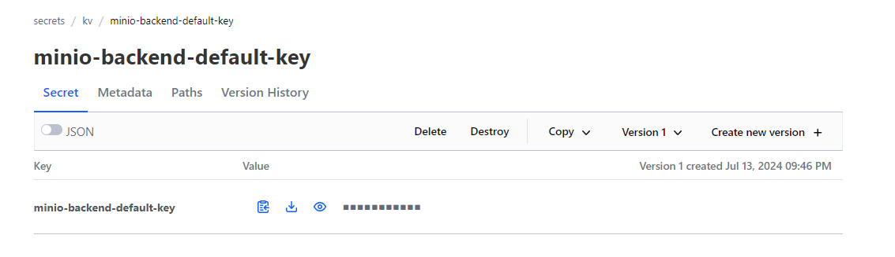
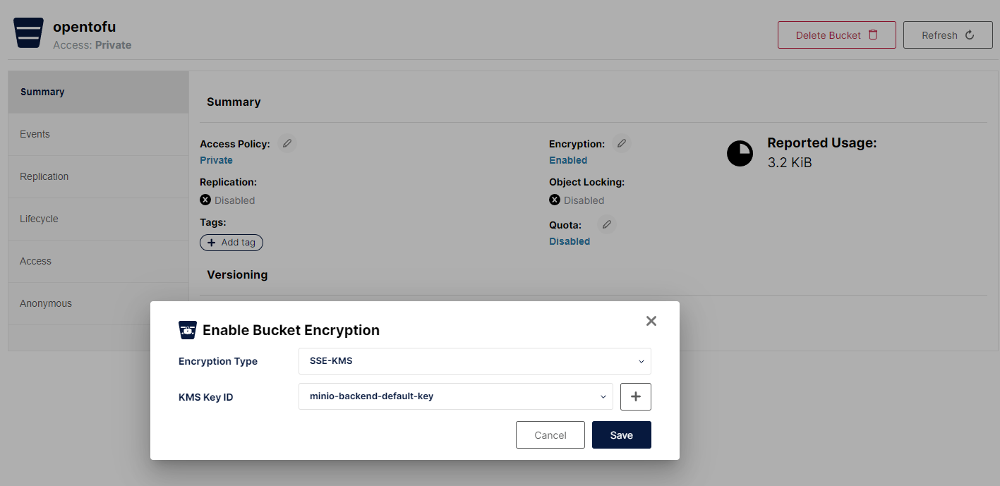
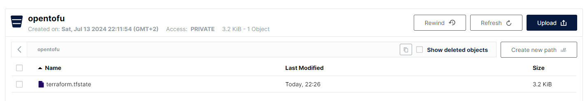

# Minio - Hashicorp Vault - OpenTofu

MinIO Server-Side Encryption (SSE) protects objects as part of write operations, allowing clients to take advantage of server processing power to secure objects at the storage layer (encryption-at-rest). SSE also provides key functionality to regulatory and compliance requirements around secure locking and erasure.

MinIO SSE uses the MinIO Key Encryption Service (KES) and an external Key Management Service (KMS) for performing secured cryptographic operations at scale. MinIO also supports client-managed key management, where the application takes full responsibility for creating and managing encryption keys for use with MinIO SSE.

This howto shows how to setup a KES server that uses Vault’s K/V engine as a persistent and secure key store.


```bash
$ cd && mkdir opentofu
$ cd opentofu
```

## Hashicorp Vault

```bash
$ vault server -dev -dev-listen-address=0.0.0.0:8200
==> Vault server configuration:

Administrative Namespace:
             Api Address: http://0.0.0.0:8200
                     Cgo: disabled
         Cluster Address: https://0.0.0.0:8201
   Environment Variables: DBUS_SESSION_BUS_ADDRESS, DISPLAY, HOME, HOSTTYPE, LANG, LESSCLOSE, LESSOPEN, LOGNAME, LS_COLORS, NAME, PATH, PULSE_SERVER, PWD, SHELL, SHLVL, TERM, USER, VIRTUALENVWRAPPER_HOOK_DIR, VIRTUALENVWRAPPER_PROJECT_FILENAME, VIRTUALENVWRAPPER_SCRIPT, VIRTUALENVWRAPPER_WORKON_CD, WAYLAND_DISPLAY, WORKON_HOME, WSL2_GUI_APPS_ENABLED, WSLENV, WSL_DISTRO_NAME, WSL_INTEROP, WT_PROFILE_ID, WT_SESSION, XDG_DATA_DIRS, XDG_RUNTIME_DIR, _
              Go Version: go1.21.8
              Listener 1: tcp (addr: "0.0.0.0:8200", cluster address: "0.0.0.0:8201", disable_request_limiter: "false", max_request_duration: "1m30s", max_request_size: "33554432", tls: "disabled")
               Log Level:
                   Mlock: supported: true, enabled: false
           Recovery Mode: false
                 Storage: inmem
                 Version: Vault v1.16.0, built 2024-03-25T12:01:32Z
             Version Sha: c20eae3e84c55bf5180ac890b83ee81c9d7ded8b

==> Vault server started! Log data will stream in below:

[...]

You may need to set the following environment variables:

    $ export VAULT_ADDR='http://0.0.0.0:8200'

The unseal key and root token are displayed below in case you want to
seal/unseal the Vault or re-authenticate.

Unseal Key: BhtntB6M+S6W/Hv9aE2hmpjhVxE1CG4B/VntMptjkO4=
Root Token: hvs.ZrZqQsOEPw33iIMZxAiZsTRn

Development mode should NOT be used in production installations!
```

```bash
$ export VAULT_ADDR='http://127.0.0.1:8200'
$ export VAULT_TOKEN=hvs.O6QNQB33ksXtMxtlRKlRZL0R
$ vault secrets enable -version=2 kv
$ cat kes-policy.hcl
path "kv/data/*" {
   capabilities = [ "create", "read" ]
}
path "kv/metadata/*" {
   capabilities = [ "list", "delete" ]
}
$ vault policy write kes-policy kes-policy.hcl
$ vault auth enable approle
$ vault write auth/approle/role/kes-server \
token_num_uses=0  \
secret_id_num_uses=0 \
period=5m
$ vault write auth/approle/role/kes-server \
policies=kes-policy
$ vault read auth/approle/role/kes-server/role-id 
$ vault write -f auth/approle/role/kes-server/secret-id 
```

## KES (Key Encryption Service)

```bash
$ kes identity new \
--key server.key \
--cert server.cert \
--ip "172.21.43.227" \
--dns localhost
Your API key:

   kes:v1:ADbNzTdLYBfmdD+pHkj2n+G9zXLbmn2hRVFUpUm2lvxi

This is the only time it is shown. Keep it secret and secure!

Your Identity:

   88857114e853938430afdb7bbce39ad643f502fa449c414ebf2dc9cc08bc1706

The identity is not a secret. It can be shared. Any peer
needs this identity in order to verify your API key.

The generated TLS private key is stored at: server.key
The generated TLS certificate is stored at: server.cert

The identity can be computed again via:

    kes identity of kes:v1:ADbNzTdLYBfmdD+pHkj2n+G9zXLbmn2hRVFUpUm2lvxi
    kes identity of server.cert
```

```bash
$ cat config.yml
admin:
  # Use the identity generated above by 'kes identity new'.
  identity: "6ef27f0007a4a3cccf9c41bbfec1ffbf5d9fff0af3092e0868f6779c7efab310" # For example: cf6c535e738c1dd47a1d746366fde7f0309d1e0a8471b9f6e909833906afbbfa

tls:
  key: server.key    # The KES server TLS private key
  cert: server.cert    # The KES server TLS certificate

keystore:
   vault:
     endpoint: http://172.21.43.227:8200
     version:  v2 # The K/V engine version - either "v1" or "v2".
     engine:   kv # The engine path of the K/V engine. The default is "kv".
     approle:
       id:     "06634c31-6097-bc8f-a8d1-b4f6f4403daa" # Your AppRole ID
       secret: "93c428e8-5f17-10c7-f6e6-2195c94f69e2" # Your AppRole Secret
```

```bash
$ kes server --config config.yml
Version             2024-06-17T15-47-05Z    commit=12195cc387d860517221548b6297471c92978f68
Runtime             go1.22.4 linux/amd64    compiler=gc
License             AGPLv3                  https://www.gnu.org/licenses/agpl-3.0.html
Copyright           MinIO, Inc.  2015-2024  https://min.io

KMS                 Hashicorp Vault: http://172.21.43.227:8200
API                 · https://127.0.0.1:7373
            · https://10.255.255.254:7373
            · https://172.21.43.227:7373
            · https://172.18.0.1:7373
            · https://172.17.0.1:7373

Docs                https://min.io/docs/kes

Admin               6ef27f0007a4a3cccf9c41bbfec1ffbf5d9fff0af3092e0868f6779c7efab310
Logs                error=stderr level=INFO
            audit=stdout level=INFO

=> Server is up and running...
```

```bash
# $ export MINIO_KMS_KES_ENDPOINT=https://172.21.43.227:7373
# $ export MINIO_KES_API_KEY=kes:v1:ADbNzTdLYBfmdD+pHkj2n+G9zXLbmn2hRVFUpUm2lvxi
# $ kes key create minio-backend-default-key -k
```

## Minio

```bash
$ podman run --rm \
-p 9000:9000 -p 9001:9001 \
-v ~/opentofu:/certs \
-e MINIO_KMS_KES_ENDPOINT=https://172.21.43.227:7373 \
-e MINIO_KMS_KES_CAPATH=/certs/server.cert \
-e MINIO_KMS_KES_KEY_NAME=minio-backend-default-key \
-e MINIO_KMS_KES_API_KEY="kes:v1:ADbNzTdLYBfmdD+pHkj2n+G9zXLbmn2hRVFUpUm2lvxi" \
quay.io/minio/minio \
server /data --console-address ":9001"
```

  

```bash
# Install minio client
$ curl https://dl.min.io/client/mc/release/linux-amd64/mc \
  --create-dirs \
  -o $HOME/minio-binaries/mc
$ chmod +x $HOME/minio-binaries/mc
$ export PATH=$PATH:$HOME/minio-binaries/
```

```bash
$ mc alias set myminio http://172.21.43.227:9000/ minioadmin minioadmin
$ mc admin info myminio/
●  172.21.43.227:9000
   Uptime: 18 minutes
   Version: 2024-07-13T01:46:15Z
   Network: 1/1 OK
   Drives: 1/1 OK
   Pool: 1

┌──────┬───────────────────────┬─────────────────────┬──────────────┐
│ Pool │ Drives Usage          │ Erasure stripe size │ Erasure sets │
│ 1st  │ 0.8% (total: 956 GiB) │ 1                   │ 1            │
└──────┴───────────────────────┴─────────────────────┴──────────────┘

0 B Used, 1 Bucket, 0 Objects
1 drive online, 0 drives offline, EC:0
```

```bash
$ mc mb --with-versioning myminio/opentofu
Bucket created successfully `myminio/opentofu`.
$ mc encrypt set sse-kms "minio-backend-default-key" myminio/opentofu
Auto encryption configuration has been set successfully for myminio/opentofu
```

  


## OpenTofu

```bash
$ cat main.tf
terraform {
  backend "s3" {
    endpoint = "http://172.21.43.227:9000"
    key = "terraform.tfstate"
    region = "main"
    skip_requesting_account_id = true
    skip_credentials_validation = true
    skip_get_ec2_platforms = true
    skip_metadata_api_check = true
    skip_region_validation = true
  }
}

resource "null_resource" "test" {
}

terraform {
  required_providers {
    vault = {
      source = "hashicorp/vault"
      version = "4.3.0"
    }
  }
}

provider "vault" {
  # Configuration options
  address = "http://172.21.43.227:8200"
  token = "hvs.ZrZqQsOEPw33iIMZxAiZsTRn"
}

resource "vault_mount" "kvv2" {
  path        = "kvv2"
  type        = "kv"
  options     = { version = "2" }
  description = "KV Version 2 secret engine mount"
}

resource "vault_kv_secret_v2" "example" {
  mount                      = vault_mount.kvv2.path
  name                       = "secret"
  cas                        = 1
  delete_all_versions        = true
  data_json                  = jsonencode(
  {
    zip       = var.password,
    foo       = "bar"
  })
}
```

```bash
$ cat variables.tf
variable "password" {
  description = "Database administrator password"
  type        = string
  sensitive   = true
}
```

```bash
$ export AWS_ACCESS_KEY_ID=minioadmin
$ export AWS_SECRET_ACCESS_KEY=minioadmin
$ export TF_VAR_password=ultrasecurepassword

```

```bash
$ tofu init
Initializing the backend...

Successfully configured the backend "s3"! OpenTofu will automatically
use this backend unless the backend configuration changes.

Initializing provider plugins...
- Finding latest version of hashicorp/null...
- Finding hashicorp/vault versions matching "4.3.0"...
- Installing hashicorp/null v3.2.2...
- Installed hashicorp/null v3.2.2 (signed, key ID 0C0AF313E5FD9F80)
- Installing hashicorp/vault v4.3.0...
- Installed hashicorp/vault v4.3.0 (signed, key ID 0C0AF313E5FD9F80)

Providers are signed by their developers.
If you'd like to know more about provider signing, you can read about it here:
https://opentofu.org/docs/cli/plugins/signing/

OpenTofu has created a lock file .terraform.lock.hcl to record the provider
selections it made above. Include this file in your version control repository
so that OpenTofu can guarantee to make the same selections by default when
you run "tofu init" in the future.

OpenTofu has been successfully initialized!

You may now begin working with OpenTofu. Try running "tofu plan" to see
any changes that are required for your infrastructure. All OpenTofu commands
should now work.

If you ever set or change modules or backend configuration for OpenTofu,
rerun this command to reinitialize your working directory. If you forget, other
commands will detect it and remind you to do so if necessary.
```

```bash
$ tofu plan

OpenTofu used the selected providers to generate the following execution plan. Resource actions are indicated with the following symbols:
  + create

OpenTofu will perform the following actions:

  # null_resource.test will be created
  + resource "null_resource" "test" {
      + id = (known after apply)
    }

  # vault_kv_secret_v2.example will be created
  + resource "vault_kv_secret_v2" "example" {
      + cas                 = 1
      + data                = (sensitive value)
      + data_json           = (sensitive value)
      + delete_all_versions = true
      + disable_read        = false
      + id                  = (known after apply)
      + metadata            = (known after apply)
      + mount               = "kvv2"
      + name                = "secret"
      + path                = (known after apply)
    }

  # vault_mount.kvv2 will be created
  + resource "vault_mount" "kvv2" {
      + accessor                     = (known after apply)
      + audit_non_hmac_request_keys  = (known after apply)
      + audit_non_hmac_response_keys = (known after apply)
      + default_lease_ttl_seconds    = (known after apply)
      + description                  = "KV Version 2 secret engine mount"
      + external_entropy_access      = false
      + id                           = (known after apply)
      + max_lease_ttl_seconds        = (known after apply)
      + options                      = {
          + "version" = "2"
        }
      + path                         = "kvv2"
      + seal_wrap                    = (known after apply)
      + type                         = "kv"
    }

Plan: 3 to add, 0 to change, 0 to destroy.

───────────────────────────────────────────────────────────────────────────────────────────────────────────────────────────────────────────────────────────────────────

Note: You didn't use the -out option to save this plan, so OpenTofu can't guarantee to take exactly these actions if you run "tofu apply" now.
```

```bash
$ tofu apply -auto-approve

OpenTofu used the selected providers to generate the following execution plan. Resource actions are indicated with the following symbols:
  + create

OpenTofu will perform the following actions:

  # null_resource.test will be created
  + resource "null_resource" "test" {
      + id = (known after apply)
    }

  # vault_kv_secret_v2.example will be created
  + resource "vault_kv_secret_v2" "example" {
      + cas                 = 1
      + data                = (sensitive value)
      + data_json           = (sensitive value)
      + delete_all_versions = true
      + disable_read        = false
      + id                  = (known after apply)
      + metadata            = (known after apply)
      + mount               = "kvv2"
      + name                = "secret"
      + path                = (known after apply)
    }

  # vault_mount.kvv2 will be created
  + resource "vault_mount" "kvv2" {
      + accessor                     = (known after apply)
      + audit_non_hmac_request_keys  = (known after apply)
      + audit_non_hmac_response_keys = (known after apply)
      + default_lease_ttl_seconds    = (known after apply)
      + description                  = "KV Version 2 secret engine mount"
      + external_entropy_access      = false
      + id                           = (known after apply)
      + max_lease_ttl_seconds        = (known after apply)
      + options                      = {
          + "version" = "2"
        }
      + path                         = "kvv2"
      + seal_wrap                    = (known after apply)
      + type                         = "kv"
    }

Plan: 3 to add, 0 to change, 0 to destroy.
vault_mount.kvv2: Creating...
null_resource.test: Creating...
null_resource.test: Creation complete after 0s [id=6786809516705012606]
vault_mount.kvv2: Creation complete after 0s [id=kvv2]
vault_kv_secret_v2.example: Creating...
vault_kv_secret_v2.example: Creation complete after 0s [id=kvv2/data/secret]

Apply complete! Resources: 3 added, 0 changed, 0 destroyed.
```
  

🔗 https://min.io/docs/kes/integrations/hashicorp-vault-keystore/  
🔗 https://min.io/docs/minio/linux/reference/minio-mc.html  
🔗 https://opentofu.org/docs/language/settings/backends/s3/